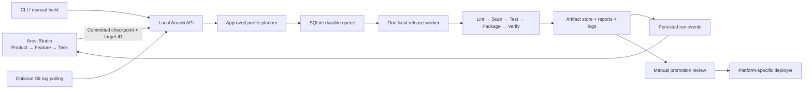

# Aruvici local delivery platform and Aruvi Studio integration

Status: target architecture, grounded in a read-only inspection of
`/Users/rajanpanneerselvam/work/AruviStudio`. This supersedes the GitHub Actions-first
direction. The first local Tauri slice is implemented: profiles/planning, queue,
foreground service, stage evidence, private API and snapshot visualization. See
[implemented behavior and limits](local-ci.md). Live Studio screens, additional
execution adapters and automatic Git tag polling below remain planned.

## Product contract

Register a repository, select a build type, fill in its required packaging settings,
review the generated pipeline once, and enable it. Aruvici then executes a fixed,
versioned sequence locally. GitHub is optional source hosting. No Jenkins server,
GitHub Actions workflow, or GitHub Actions runner is required in the new architecture.

Example experience: select `Rust-Tauri`, choose `src-tauri/Cargo.toml`, review the
bundle/data settings, select “Build on Studio checkpoint”, and enable. Studio shows
each lint/test/security/package stage, its evidence and the downloadable package.
“Ready for promotion” and “Installed” remain distinct states.

Build-type tags are typed profile selectors, not Git version tags. One target has
one primary build profile. A product may contain many targets in one or several
repositories: desktop client (`Rust-Tauri`), API (`Rust-Docker`), iPhone client
(`Native iOS`), and Android client (`Native Android`). General product tags remain
descriptive; only an explicitly enabled target binding can schedule executable work.

## What Studio already supplies

| Existing source | Observed behavior | Integration decision |
| --- | --- | --- |
| `src/lib/types/products.ts` | Product has `tags: string[]` | Present build-type badges, backed by separate typed target bindings |
| `src/lib/types/repositories.ts` | Repository IDs, paths, remotes; attachments to products/product areas | Reuse repository identity and attachment resolution |
| `src-tauri/src/services/workflow_repository_guard.rs` | Work item can use active repository or resolved attachment | Submit the exact resolved repository and committed revision |
| `src/lib/types/workflows.ts` | Workflow/agent runs, stage history, sequenced external CLI events | Link CI runs to these IDs; keep deterministic CI stages separate from agent stages |
| `src-tauri/src/domain/workflow.rs` | Coding, generated tests, Docker test execution, security review, push gates | Add a checkpoint handoff; do not treat an agent review as a passing executable CI check |
| `src/lib/types/artifacts.ts` | Work-item-linked artifacts with path, MIME, size and summary | Add CI artifact references for project runs with optional work-item linkage |
| `src-tauri/src/commands/artifact_commands.rs` | Artifact content is loaded as a UTF-8 string | Add binary/range downloads and typed previews; do not load ZIP/IPA/video through this command |
| `src/features/work-items/components/WorkItemArtifactModal.tsx` | Text and coding-trace previews | Retain those views and add CI run/package/report views |
| `README.md` | Desktop, headless Axum bridge, remote UI and MCP | Put the connector behind shared backend services, available to both desktop and headless Studio |

The artifact service module itself currently contains only a comment; actual reads
go through artifact commands and persistence. The inspected repository working tree
was clean. No Studio files, databases, credentials or services were modified.

Studio's package.json already declares frontend checks/tests, Rust unit/integration
suites, and Playwright suites. Its Tauri config uses port 1420 and has no separate
debug bundle identity configured there. These are onboarding inputs; a full audit
of Studio's data paths, scripts and sidecar packaging is still needed before using
it as the first release target. Do not invoke its existing release scripts from CI
until any installation and database side effects have been separated.

## Components and ownership



Studio owns planning, coding and product context. Aruvici owns approved build policy,
queue, tool execution, evidence and deployment history. Each owns its database; the
connector uses an API rather than cross-writing SQLite tables. Studio can close
without cancelling a queued/running build. Reopening it replays persisted events.

Start with a launchd user service plus a private Unix socket. The Studio Rust backend
and CLI use that socket; the browser UI never connects directly to a privileged build
daemon. A separately configured loopback HTTP adapter may support headless clients;
require authentication on all endpoints, origin checks, request limits and no wildcard
CORS. Never reuse or expose Studio's existing tokens automatically. Service installation
and credential setup are separately approved operations.

When the worker uses a separate macOS account, provision an explicit socket group/ACL
or authenticated loopback bridge. That is required deployment setup, not something a
frontend can bypass. The build account has no production-data or installation rights.
An interactive promotion helper operates as the deployment user and retains the
existing just-in-time confirmation before filesystem changes.

## Versioned, pre-approved profiles

Every profile has an immutable ID/version/digest, ordered stages, required inputs,
toolchain requirements, output contracts, timeout/resource limits and gate policies.
Project metadata supplies values such as manifest path, Dockerfile or Xcode scheme;
it does not define arbitrary pipeline shell stages. The trusted administrator may
add audited extensions, each with its own version and approval.

| Display tag / profile | Required user configuration | Opinionated stages | Captured deliverables |
| --- | --- | --- | --- |
| Rust-Tauri / `rust-tauri@1` | Cargo manifest, frontend root/package manager, Tauri config, bundle identity, architecture, isolated data paths | Rust format/Clippy, TS/frontend checks, secret scan, dependency checks, frontend/Rust tests, Tauri release build, signature verification | macOS app ZIP, checksum, manifest, test/security reports, debug symbols when produced |
| Rust-Docker / `rust-docker@1` | Cargo manifest, Dockerfile, bounded build context, build stage and target platform | Rust format/Clippy/tests, secret/dependency scans, Dockerfile checks, image build, image vulnerability scan, export verification | OCI image archive and digest, SBOM, scan/test reports, build metadata |
| Native iOS / `native-ios@1` | Xcode project/workspace, scheme, configuration, simulator destination; optional approved signing/export profile | Configured Swift lint, secret/dependency checks, simulator build/tests, archive; distribution export only when credentials exist | xcresult bundle, simulator app/test evidence, xcarchive; IPA only for a configured signed distribution build |
| Native Android / `native-android@1` | Gradle wrapper, module, variant, SDK/JDK requirements; optional signing profile | Android lint, secret/dependency checks, unit tests, configured emulator tests, assemble/bundle, signature checks | APK/AAB as appropriate, lint/test reports, mapping/native symbols when produced |

Native iOS means an Xcode-native target. A Tauri iOS/Android app would use additional
Tauri-mobile profiles later, not these native profiles. Rust-Docker produces a Linux
container image; macOS host tests alone cannot certify Linux behavior. Run relevant
Rust tests in the Linux build/test stage too. Docker is a required installed tool,
not something CI installs or starts implicitly during onboarding.

Suggested tools to evaluate/pin during adapter implementation: rustfmt/Clippy,
Gitleaks with redacted reports, ecosystem dependency auditing, Docker BuildKit and
an OCI scanner, Xcode command-line tools, Gradle/Android lint. Exact versions and flags
must be validated then. Current web documentation lookup was unavailable during this
planning pass; these are proposed tool choices, not verified installation recipes.

All profiles begin with input/toolchain preflight and source secret scanning before
dependency scripts or compilation. All end with artifact collection and a gate
summary. Reports/logs are collected even when a stage fails; failed runs never create
a promotable release. Missing mandatory tools report `blocked`, never green `skipped`.
Optional checks have an explicit reason and are visible in the UI.

Pre-approved commands still execute project-controlled npm hooks, build.rs files,
Gradle logic and Dockerfiles. Build-type approval is not a code sandbox. Pin tool and
profile revisions; isolate accounts/workspaces; constrain mounts/network/secrets;
never put production data or the host Docker socket inside build containers.

## Minimal project onboarding

1. Attach the repository in Studio (existing capability).
2. Add a build target and choose its type. Detection suggests inputs; it does not
   silently authorize discovered scripts.
3. Fill required paths/settings. Missing Dockerfile, scheme or wrapper is shown as a
   concrete readiness issue. Users supply those files, as requested.
4. Review the resolved stage list, tools, network access, inputs, artifact outputs
   and deployment destination. Approve the target/policy digest once.
5. Enable manual or Studio-checkpoint builds; optionally enable version-tag polling.
   Ordinary code revisions then run under the existing policy without another prompt.

Store portable metadata in `.aruvici/project.toml`; store machine paths, approvals,
Keychain references and installation destinations in the local registry. The draft
format is in `examples/project.proposed.toml`; the current CLI does not parse it yet.
When policy-sensitive settings change, suspend automation until the changed policy
is reviewed. Selecting a tag on a product must not approve an AI-generated command.

## Triggers and scheduling

The initial local trigger is manual queueing or Studio submitting a **committed**
checkpoint with target/repository/commit and optional product/work-item/workflow IDs.
Never build a dirty live workspace while a coding agent is writing to it. Studio
explicitly creates its checkpoint; Aruvici does not commit changes on its behalf.
Agent-generated code is built and tested without granting the agent promotion rights.

Remote Git tag polling is optional. Use a managed mirror, not fetch/reset in a user's
checkout. At first enablement, baseline existing tags without building the entire
history; let the operator explicitly choose backfill. Persist both tag object and
peeled commit IDs. Fetch then verify that the resolved commit matches the scheduled
revision; a moved/deleted tag is an alert requiring a deliberate choice, not a silent
replacement. Whether lightweight tags are allowed is an explicit source policy.

Deduplicate trigger delivery with `(target, commit, profile_digest, request_key)`.
Repeated requests return the same run; “Rebuild” supplies a new attempt key. A unique
constraint and transactional enqueue give one logical job for repeated delivery;
do not claim exactly-once execution through power loss. Claim jobs transactionally;
mark abandoned attempts interrupted, with explicit retry semantics.

Initially execute one resource-intensive pipeline at a time across profiles, with
per-target locks and resource locks for simulator/emulator/device access. Polling,
log viewing and queueing remain responsive while the worker builds. Retain jobs
while the Mac sleeps/offline; expose last heartbeat, waiting reason, attempt and
queue age. Cancellation signals process groups, preserves evidence, and finishes
as cancelled/interrupted rather than success. Production apps remain independent.

## Runs, events and artifacts are first-class data

Extend Aruvici SQLite with versioned migrations and these conceptual entities:

- `targets`: stable ID, repository ID/subdirectory, profile reference, approved policy.
- `runs`: exact commit/tree, profile/config/toolchain digests, trigger and Studio IDs,
  status, attempt, timestamps, queue/resource waits and gate summary.
- `stage_runs`: stage ID, dependencies, status, command identity, exit code, duration,
  log references and parsed summary. Retries create new attempts.
- `run_events`: monotonically increasing sequence, run/stage IDs, UTC timestamp,
  event type and versioned payload. Persist before notifying clients.
- `artifacts`: opaque ID, producing run/stage, kind/MIME, name, bytes, SHA-256 or OCI
  digest, relative storage location, retention and verification state.
- `reports/findings`: normalized test cases, lint/security findings, severity, tool
  version and raw-report artifact reference. Store redacted findings, never secret values.
- `promotions`: exact immutable artifact reference, requester/approver, environment,
  previous installation/image digest, status, rollback reference and audit times.
- `source_observations`: tag/ref objects, baseline, observed commits and enqueue state.

Capture source commit, pipeline configuration and tool versions so every result is
explainable. Snapshot/digest build-relevant files such as lockfiles, Dockerfile and
export configuration. Hashing proves identity of evidence, not reproducibility of
network-dependent builds.

Use a manager-owned artifact store; stream outputs, hash on ingest, publish by atomic
rename and reject escaping paths/symlinks. Start with the existing restricted bundle
format; add audited internal-symlink handling before onboarding framework bundles.
Artifacts are accessible through IDs, never arbitrary absolute-path download APIs.
OCI digest and archive SHA-256 are separate metadata fields. Pin deployed artifacts
and rollback dependencies against cleanup. Successful builds and failed diagnostic
outputs have configurable retention with size quotas and previewable recovery.

Persist bounded/redacted stdout/stderr per stage. Use sequenced log chunks with
offsets/backpressure; don't buffer unlimited logs in SQLite or the frontend. Security
scanner output is sensitive even when a run fails. Default previews redact secrets,
show text as text, and sandbox HTML reports without script execution. Binary packages
download/Reveal only; images/video/test traces get explicit size-limited viewers.

## Studio/API contract

`integration/ci-contract.proposed.ts` defines draft DTOs. The API operates on target,
run and artifact IDs; requests cannot supply command lines or filesystem paths.
Proposed resources (not existing endpoints):

| Operation | Purpose |
| --- | --- |
| `GET /v1/profiles`, `GET /v1/targets/{id}/readiness` | Types and missing prerequisites |
| `POST /v1/targets/{id}/plan` | Resolve an inspectable, non-executing pipeline |
| `POST /v1/runs` | Queue approved target + commit + idempotency key + Studio context |
| `GET /v1/runs/{id}` | Run, stages, findings and artifact summary |
| `GET /v1/runs/{id}/events?after=N` | Reconnect/replay; stream on supported transports |
| `GET /v1/runs/{id}/stages/{stage}/logs?offset=N` | Bounded log chunks |
| `GET /v1/artifacts/{id}`, `/content` | Metadata and bounded/range-capable download |
| `POST /v1/runs/{id}/cancel`, `/retry` | Audited control of an attempt |
| `POST /v1/promotions/preview` | Artifact/environment readiness without installation |

Execution of a promotion goes through the local interactive helper's confirmation,
not an unauthenticated or agent-callable HTTP endpoint. Later visual approvals must
bind to artifact digest, destination, policy version and expiry and recheck just
before mutation. The existing CLI approval must remain until that is implemented.

Studio stores `ci_run_id` references and caches read models. CI outcomes don't mark
the feature complete automatically: its product acceptance criteria and review still
apply. A coding agent can request a build and read sanitized findings to propose a
fix; it cannot relax gates, change trusted profiles or authorize production deployment.

## Full visual experience

Six connected views, all backed by the event/artifact model from the first backend
release. They must work for CLI-started runs even while Studio was closed.

1. **Product Delivery:** target cards with type badge, configured/pending inputs,
   last verified commit, last run and currently deployed version. Multi-target product
   status never collapses one failed platform into a green product badge.
2. **Pipeline Setup:** tag/type selector, detected inputs, missing-file checklist,
   ordered stage preview, tool versions, artifact outputs and policy diff/approval.
3. **Build Queue:** FIFO order, target/commit, trigger, running stage, elapsed time,
   waiting resource, cancellation and worker/offline status.
4. **Run Detail:** stage graph/timeline plus tabs for Logs, Tests, Security, Artifacts
   and Provenance. Select a failed stage to see its exact command identity, exit code,
   redacted diagnostics and related artifacts. Display interrupted/blocked/skipped
   explicitly. Compare attempts by commit, profile and test findings.
5. **Artifact Library:** filter by product/target/run/type; packages, test reports,
   screenshots, video, symbols, SBOMs and manifests. Show digest, size, producing stage,
   signature, retention and “used by deployment”. Preview or download by type.
6. **Promotion & Rollback:** reviewed artifact/version versus installed version,
   verified digest/signature, running-app readiness, destination and backup preview,
   explicit human confirmation, deployment history and recoverable failure state.

Run-detail layout:

```text
Aruvi Studio / Product / Desktop / Build #42        [Cancel / Retry]
Rust-Tauri · commit 8c31… · profile v1 · Studio task reference

Preflight ✓ → Secrets ✓ → Lint ✓ → Tests ✗ → Package blocked

Stages                  | Logs | Tests | Security | Artifacts | Provenance
  Preflight       2s    | Failed: SQLite migration fixture test
  Secrets         4s    | Expected temporary fixture; path assertion failed
  Lint           12s    | 83 passed · 1 failed · report available
  Tests          31s    |
  Package       blocked| Artifacts: test-report.json · redacted-stage.log

Release eligibility: blocked by failed tests       Deployment: unchanged
```

This is a design wireframe, not a running dashboard. Reuse Studio's React Query
query/mutation structure and workflow timeline components where appropriate; add a
`features/ci` area and a backend `ci_client` service. Extend the existing artifact
modal through typed CI previews rather than replacing agent artifact semantics.

## Phased implementation and acceptance

| Phase | Concrete change | Acceptance evidence |
| --- | --- | --- |
| 1. Local engine contract | Profile planner, target binding, schema migrations, per-stage events/logs, artifact registry; local queue is default and GitHub dispatch becomes optional legacy | Implemented for Tauri/Docker; reject unknown profiles/unsafe paths/missing required inputs; reconnect and replay failed-run evidence |
| 2. Desktop vertical slice | Upgrade existing Tauri executor to profile stages including lint/scans/reports; service/API and manual/Studio request adapter | One small audited Tauri app builds locally without GitHub Actions; duplicate submissions deduplicate; termination releases locks; failure blocks promotion; UI reads captured package/report |
| 3. Studio views | Setup, queue, run detail and artifact library; add product/task CI references | Select tag, resolve inputs, queue committed checkpoint, watch stages, inspect test failure, download verified artifact; Studio restart loses no run history |
| 4. Rust-Docker | Linux test execution, Dockerfile/context preflight, image scan/export, OCI artifact semantics | OCI export, structural verification and evidence capture implemented. Linux runtime tests/image scan/import testing remain. |
| 5. Mobile | Separate iOS simulator and Android test/package adapters, reports and toolchain readiness | Simulator/emulator tests with disposable data; missing credentials shown clearly; Android debug and iOS simulator packages tested before distribution signing |
| 6. Automation and promotion UI | Optional tag poller, baseline/ref-movement handling, launchd packaging, visual promotion/helper bridge | Sleep/restart/retry/ref-movement tests; one release worker; confirmed install/rollback only; no repeat deployment after interruption |

Keep each phase an end-to-end observable slice. Artifact capture is part of phase 1/2,
not postponed until after the dashboard. Do not enable an unsupported profile as a
generic shell runner. The first real project is an audited small Tauri fixture; Studio
is onboarded after its packaging/sidecars/data paths pass review so developing Studio
does not disrupt the production Studio instance managing the work.

## Existing implementation gap

Reusable today: Rust CLI, path checks, isolated builds, OS locks, local queue, checksum
and macOS signature verification, deployment/backup/recovery mechanics. Current queue
is drain-on-command; current history is coarse events; configured commands are argv
arrays; GitHub remains hardcoded in origin/dispatch logic. Those need explicit migration.

New work: constrained profiles, local-first source identity, persistent scheduler/API,
structured stages/log capture, scanner adapters and gates, binary artifact serving,
Studio connector/views, Docker/mobile adapters and optional remote ref polling. This
plan and draft contracts do not claim those capabilities are already implemented.
